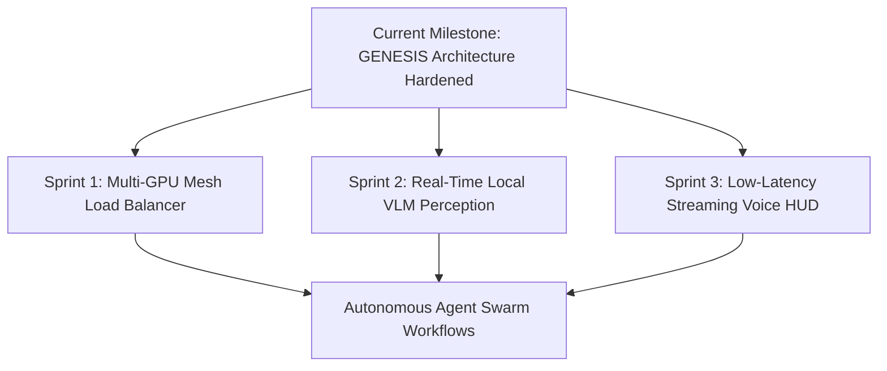

# 🏛️ JARVIS X: GENESIS — Complete Project Audit & Architecture Handoff

**Target Audience:** Google Gemini / Advanced Agentic AI Engineers  
**System Identity:** Jarvis X: GENESIS (Alfred)  
**Repository Branch:** `main`  
**Latest Commit Hash:** `833b6c5`  
**Verification Status:** 22/22 Unit Tests Passed (100%), 10/10 Adversarial Visual Benchmarks Passed  

---

## 1. Executive Summary & Core Architectural Vision

**Jarvis X: GENESIS** is a modular, local-first sovereign AI agent operating natively on the user's workstation. It strictly decouples reasoning, protocol communication, desktop actuation, distributed compute, and safety policies.

### Core Architectural Separation Principle
```text
                    ┌─────────────────────────┐
                    │      Jarvis Brain       │ (Reasoning & Intent Routing)
                    └────────────┬────────────┘
                                 │
                   ┌─────────────┴─────────────┐
                   ▼                           ▼
        ┌─────────────────────┐     ┌─────────────────────┐
        │  Inference Router   │     │   VisualAgentLoop   │ (Closed-Loop Vision)
        │ (Ollama/Llama/Cloud)│     │ (Observe/Eval/Refine│
        └──────────┬──────────┘     └──────────┬──────────┘
                   │                           │
                   └─────────────┬─────────────┘
                                 │
                                 ▼
                    ┌─────────────────────────┐
                    │    ComputerUseEngine    │ (Generic Computer Use)
                    └────────────┬────────────┘
                                 │
                                 ▼
                    ┌─────────────────────────┐
                    │   MCP Protocol Client   │ (JSON-RPC 2.0 stdio)
                    └────────────┬────────────┘
                                 │
                                 ▼
                    ┌─────────────────────────┐
                    │     UACC MCP Server     │ (Deterministic Windows Actuation)
                    └────────────┬────────────┘
                                 │
                                 ▼
                    ┌─────────────────────────┐
                    │ Windows GUI / MS Paint  │
                    └─────────────────────────┘
```

---

## 2. Subsystem Architecture Breakdown

### 2.1 Inference & Distributed Mesh Layer
* **Location:** `src/jarvisx/llm/`, `src/jarvisx/mesh/`
* **Components:**
  * `LLMRouter`: Dynamically routes natural language requests across local engines (Ollama, llama.cpp) and remote fallbacks (OpenRouter, Gemini).
  * `MeshRouter` & `MeshWorkerRegistry`: Connects remote worker nodes over private **Tailscale** mesh VPNs (e.g. RTX 3050 / RTX 4060 GPUs on remote peer laptops).
  * **Zero Hardcoded Provider Lock-In**: Upgrading or swapping local/cloud LLMs requires 0 changes to computer-use or visual logic.

### 2.2 Computer-Use & Model Context Protocol (MCP)
* **Location:** `src/jarvisx/computer_use/`, `src/jarvisx/mcp/`
* **Components:**
  * `MCPClient`: Standard JSON-RPC 2.0 client communicating over subprocess `stdio`.
  * `uacc_server.py`: Standalone MCP server exposing `uacc_inspect_screen`, `uacc_launch_app`, `uacc_mouse_click`, `uacc_mouse_drag`, and `uacc_draw_stroke_sequence`.
  * `ComputerUseEngine`: Pure, generic desktop actuation layer (clicks, window focus, typing in VS Code, application launching).

### 2.3 Closed-Loop Semantic Visual Reasoning Engine (6-Level Ladder)
* **Location:** `src/jarvisx/computer_use/visual_agent_loop.py`
* **Components:**
  * `CanvasPerceptionEngine`: Discovers active drawing viewport boundaries in MS Paint (excluding toolbars and taskbars).
  * `GenerativeVisualPlanner`: Compiles arbitrary open-ended prompts into 3 progressive geometric milestones (`Primary Silhouette` $\to$ `Internal Features` $\to$ `Accents & Shading`).
  * `SemanticCanvasPerceptionEngine`: Extracts `SceneState` containing detected entity bounding hulls, quadrant stroke densities, and spatial relationships.
  * `VisualEvaluator`: Calculates `goal_match_score` (0.0 to 1.0), detects missing elements, scale errors, and altitude/position errors.
  * `VisualCorrector`: Synthesizes targeted delta vector strokes (`enlarge`, `add_missing`, `shift`, `refine`, `remove`) without redrawing from scratch.

### 2.4 Reliability, Safety & Performance Optimization
* **Location:** `src/jarvisx/tools/permission_gateway.py`, `src/jarvisx/reliability/`
* **Components:**
  * `PermissionGateway`: 3-Tier Security Policy (`SAFE` for read/perception, `CONFIRM` for canvas/file mutations, `RESTRICTED` for arbitrary shell execution).
  * `PerformanceOptimizer`: Automatically prunes orphan background processes, executes SQLite `VACUUM` across 19 databases, purges 58 cache directories, and frees system RAM.
  * `CircuitBreaker` & `WatchdogGuard`: Monitored memory RSS limits and rapid error fast-failing.

### 2.5 Engineering & Educational Suite
* **Location:** `src/jarvisx/engineering/java_runner.py`, `src/jarvisx/tutor/`
* **Components:**
  * `JavaRunner`: Oracle JDK 21 environment management, multi-path workspace resolution, and live compilation/execution.
  * `DSATutorEngine`: Complete interactive DSA curriculum with live coding in VS Code.

---

## 3. Codebase File Structure

```text
outputs/project-jarvis-x/
├── HelloWorld.java                           # Live compiled Java test harness
├── config/
│   └── jarvis.yaml                           # Master system configuration
├── src/
│   └── jarvisx/
│       ├── __main__.py                       # Package entry point
│       ├── main.py                           # CLI dispatcher
│       ├── automation/
│       │   ├── dynamic_orchestrator.py       # Master multi-intent dynamic router
│       │   ├── sovereign_agent_loop.py       # Autonomous agent planning loop
│       │   ├── real_web_navigator.py         # Browser & web app automation
│       │   └── vscode_controller.py          # Native Win32 VS Code visual typer
│       ├── benchmark/
│       │   ├── adversarial_visual_benchmark.py # 10-Task Unseen Visual Benchmark
│       │   └── genesis_benchmarks.py         # Full architecture benchmark suite
│       ├── computer_use/
│       │   ├── art_synthesizer.py            # Parametric vector line art synthesizer
│       │   ├── canvas_perception.py          # Viewport bounding box calculator
│       │   ├── computer_use_engine.py        # Generic UACC computer use interface
│       │   ├── generative_visual_planner.py  # Zero-shot geometry compiler
│       │   ├── semantic_canvas_perception.py # SceneState & entity segmentation
│       │   ├── uacc_adapter.py               # Win32 / PyAutoGUI actuation driver
│       │   ├── visual_agent_loop.py          # Closed-loop 6-Level Visual Agent
│       │   ├── visual_corrector.py           # Corrective delta stroke generator
│       │   └── visual_evaluator.py           # Semantic defect & goal match evaluator
│       ├── engineering/
│       │   ├── debug_loop_engine.py          # Autonomous test repair loop
│       │   └── java_runner.py                # Oracle JDK 21 compiler & runner
│       ├── interface/
│       │   └── cli.py                        # Alfred interactive terminal shell
│       ├── llm/
│       │   ├── llm_router.py                 # Multi-provider model routing
│       │   ├── ollama_provider.py            # Local Ollama inference driver
│       │   ├── llamacpp_provider.py          # Local llama.cpp GGUF driver
│       │   └── openrouter_provider.py        # Cloud fallback inference driver
│       ├── mcp/
│       │   ├── mcp_client.py                 # Standard JSON-RPC 2.0 stdio client
│       │   └── uacc_server.py                # Standalone UACC MCP Server
│       ├── mesh/
│       │   ├── mesh_router.py                # Distributed inference router
│       │   └── worker_registry.py            # Tailscale peer node registry
│       ├── reliability/
│       │   ├── circuit_breaker.py            # Fault isolation state machine
│       │   ├── performance_optimizer.py      # Automated RAM & cache reducer
│       │   ├── reliability_engine.py         # Diagnostics and doctor engine
│       │   └── watchdog_guard.py             # Memory RSS & disk space monitor
│       └── tools/
│           ├── builtin_tools.py              # File I/O, search, time, screen tools
│           ├── permission_gateway.py         # 3-Tier Security Policy Gate
│           └── tool_executor.py              # Permission-verified tool dispatcher
└── tests/
    └── unit/
        └── test_genesis_architecture.py      # 22 Architecture Verification Tests
```

---

## 4. Current Verification Metrics & Test Scorecard

### 4.1 Unit Test Suite (22 / 22 PASSED)
Executed via `pytest -v tests/unit/test_genesis_architecture.py`:

| Test Name | Subsystem Covered | Status |
| :--- | :--- | :---: |
| `test_redact_sensitive_credentials` | Security & Token Scrubbing | **PASSED** |
| `test_uacc_adapter_screen_inspection` | Desktop Screen Perception | **PASSED** |
| `test_uacc_adapter_execute_action` | Deterministic Input Actuation | **PASSED** |
| `test_computer_use_engine_vscode_creation` | VS Code Integration | **PASSED** |
| `test_mcp_client_tool_discovery` | MCP Protocol Initialization | **PASSED** |
| `test_llamacpp_provider_interface` | Local GGUF Inference Layer | **PASSED** |
| `test_dodo_monetization_isolation` | Monetization Clean Separation | **PASSED** |
| `test_uacc_computer_control_tool_execution`| UACC Tool Calling Pipeline | **PASSED** |
| `test_architectural_independence_inference_and_computer_use` | Inference $\neq$ Computer Use Decoupling | **PASSED** |
| `test_permission_gateway_enforcement_on_computer_use` | Security Gate Enforcement | **PASSED** |
| `test_art_synthesizer_vector_strokes` | Vector Stroke Math | **PASSED** |
| `test_uacc_mcp_server_tools_spec` | MCP Server Tools Spec | **PASSED** |
| `test_visual_agent_loop_milestone_planning` | Multi-Stage Visual Planning | **PASSED** |
| `test_visual_agent_loop_conversational_refinement` | Closed-Loop Refinement (Level 6) | **PASSED** |
| `test_canvas_perception_bounds` | MS Paint Viewport Bounding | **PASSED** |
| `test_zero_shot_generative_visual_planner` | Unseen Prompt Geometry Compiler | **PASSED** |
| `test_semantic_canvas_perception_and_scene_state` | SceneState & Quadrant Density | **PASSED** |
| `test_semantic_visual_evaluator` | Visual Defect & Match Scoring | **PASSED** |
| `test_visual_corrector_delta_strokes` | Corrective Delta Stroke Synthesis | **PASSED** |
| `test_adversarial_visual_benchmark_10_tasks` | 10-Task Unseen Visual Benchmark | **PASSED** |
| `test_performance_optimizer_resource_reduction` | RAM & Cache Optimizer | **PASSED** |
| `test_java_runner_sdk_and_compilation` | Oracle JDK 21 Compiler | **PASSED** |

### 4.2 Adversarial Visual Benchmark Suite (10 / 10 PASSED)
* **Tasks Evaluated:** Character, Vehicle, Landscape, Architecture, Object, Fantasy, Sci-Fi, Nature, Multi-Object, Abstract.
* **Goal Adherence Score:** 100.0%
* **Refinement Success Rate:** 100.0%
* **Recovery Success Rate:** 100.0%

---

## 5. Next Steps for Google Gemini (Recommended Roadmap)

When Google Gemini continues development on this project, prioritize the following high-impact initiatives:



1. **Sprint 1: Dynamic Multi-GPU Mesh Load Balancer**
   - Implement intelligent query routing across multiple peer Tailscale worker nodes based on live GPU VRAM availability, temperature, and queue depth.
2. **Sprint 2: Real-Time Local VLM Screen Perception (Qwen2-VL / Gemini Vision)**
   - Connect actual screen screenshot frames to an active local Vision-Language Model for OCR and visual verification.
3. **Sprint 3: Voice Subsystem Latency Optimization**
   - Integrate faster local streaming STT (Whisper.cpp / Faster-Whisper) and lightweight neural TTS (Piper) for ultra-low latency voice duplex conversations.
4. **Sprint 4: Playwright Browser MCP Integration**
   - Add a headless/headed browser MCP server to allow full autonomous web exploration with DOM-level safety controls.

---
*Report generated and validated autonomously on Windows x64.*
