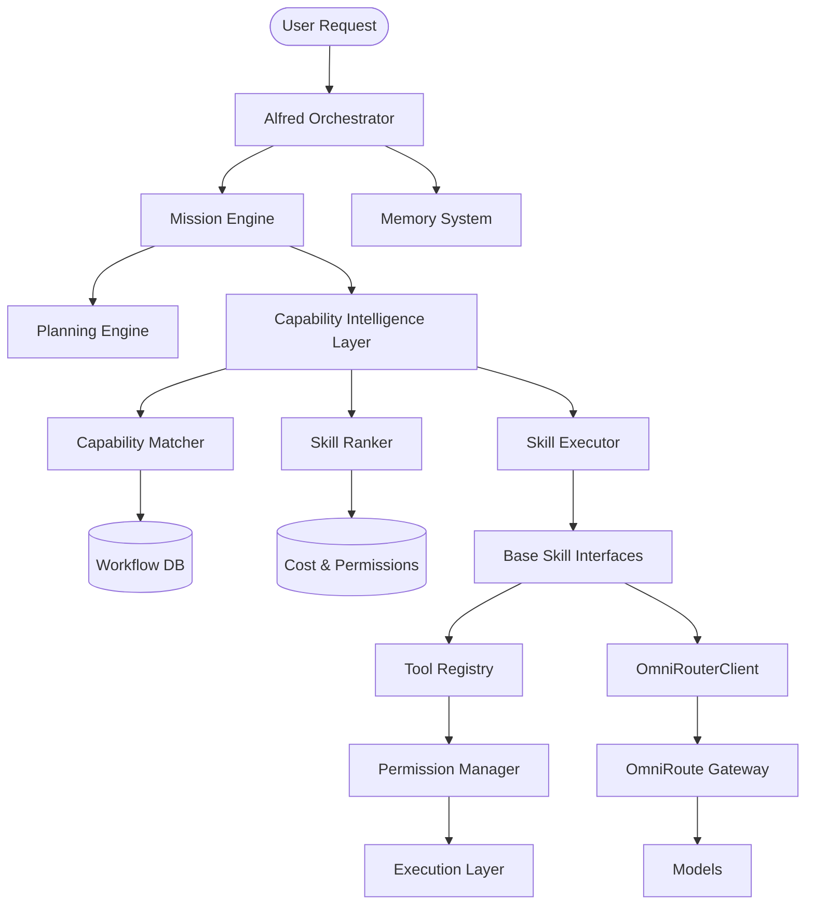
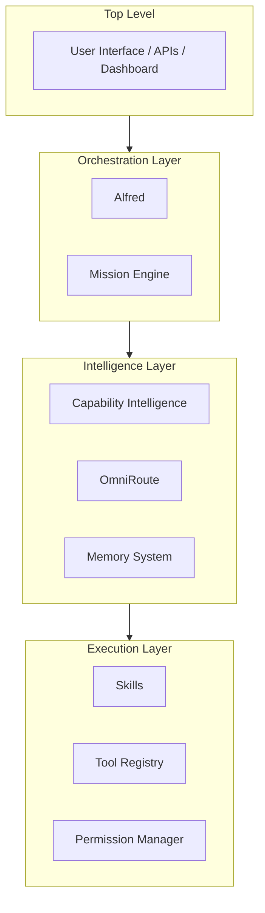

# Jarvis X Call Graph & Layer Diagram

## Dependency Graph

## Layer Diagram

## Execution Flow (One Alfred Rule)
1. **User** invokes an intent via Dashboard, CLI, or API.
2. **Alfred** intercepts the intent and categorizes it.
3. If it requires work, Alfred delegates to the **Mission Engine**.
4. The **Mission Engine** determines steps and invokes the **Capability Intelligence Layer**.
5. The **Matcher & Ranker** locate the best **Skill** for the step.
6. The **Skill** attempts execution.
7. If the Skill requires tools (OS, Sandbox, Browser), it requests them from the **Tool Registry**.
8. The **Tool Registry** enforces security boundaries via the **Permission Manager**.
9. The **Execution** finally occurs.
