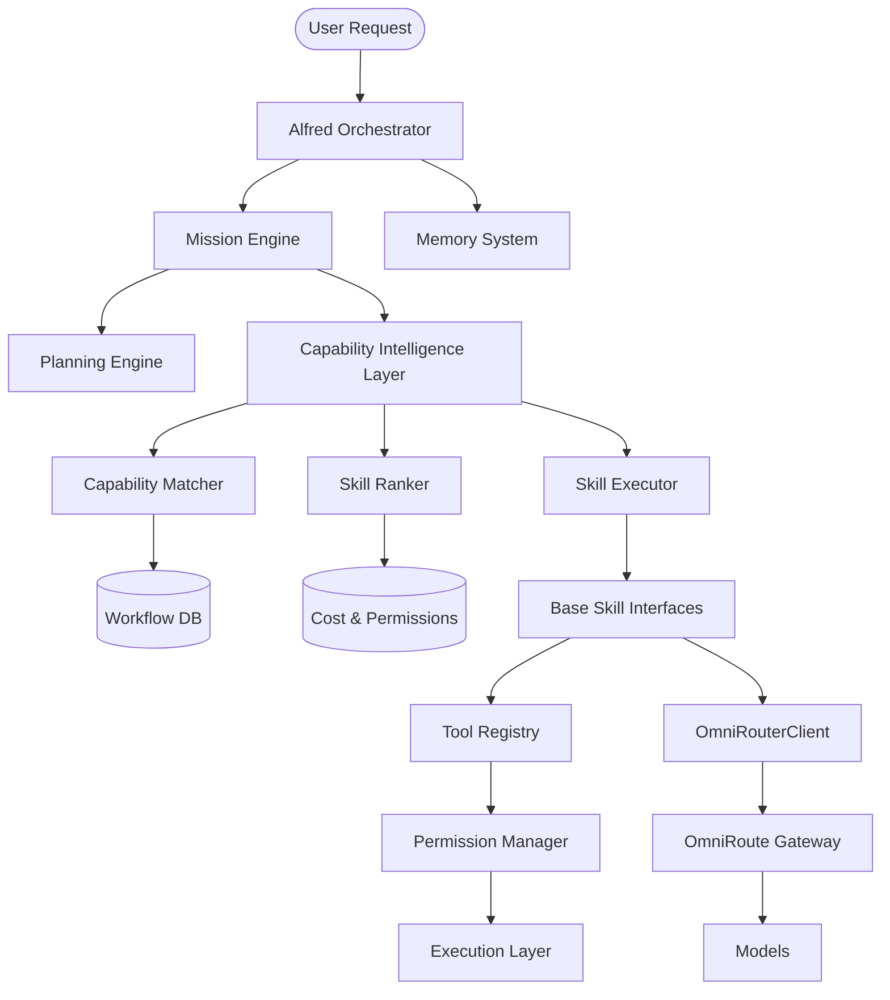

```mermaid
graph TD
    User([User Request]) --> Alfred[Alfred Orchestrator]
    Alfred --> MissionEngine[Mission Engine]
    Alfred --> MemorySystem[Memory System]
    MissionEngine --> PlanningEngine[Planning Engine]
    MissionEngine --> CapabilityIntelligence[Capability Intelligence Layer]
    CapabilityIntelligence --> Matcher[Capability Matcher]
    CapabilityIntelligence --> Ranker[Skill Ranker]
    Matcher --> WorkflowHistory[(Workflow DB)]
    Ranker --> ExecutionCost[(Cost & Permissions)]
    CapabilityIntelligence --> SkillExecutor[Skill Executor]
    SkillExecutor --> BaseSkill[Base Skill Interfaces]
    BaseSkill --> ToolRegistry[Tool Registry]
    ToolRegistry --> PermissionManager[Permission Manager]
    PermissionManager --> Execution[Execution Layer]
    BaseSkill --> LLMRouter[OmniRouterClient]
    LLMRouter --> OmniRoute[OmniRoute Gateway]
    OmniRoute --> Provider[Models]
```
