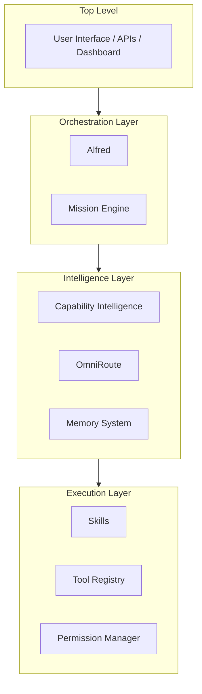

```mermaid
flowchart TD
    subgraph L1 [Top Level]
        U[User Interface / APIs / Dashboard]
    end
    
    subgraph L2 [Orchestration Layer]
        A[Alfred]
        ME[Mission Engine]
    end
    
    subgraph L3 [Intelligence Layer]
        CI[Capability Intelligence]
        LLM[OmniRoute]
        MEM[Memory System]
    end
    
    subgraph L4 [Execution Layer]
        S[Skills]
        T[Tool Registry]
        P[Permission Manager]
    end
    
    L1 --> L2
    L2 --> L3
    L3 --> L4
```
