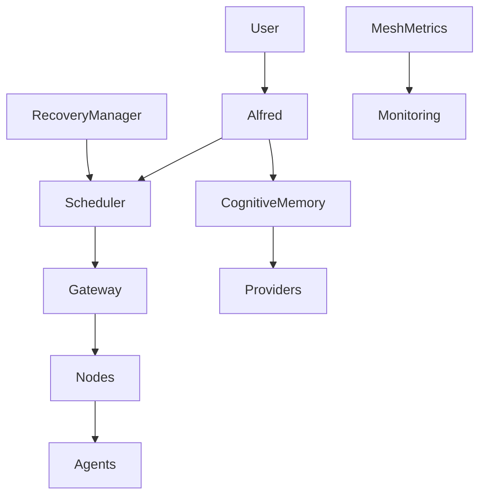

# Cognitive Agent Mesh Architecture

## 1. Overview

Jarvis X has successfully completed its evolution from a single machine multi-agent system into a production cognitive distributed network. 

This transition represents a fundamental shift in the system's capabilities:
- **From local to distributed:** Agents and workloads are no longer constrained to a single machine. The new architecture distributes tasks across a resilient mesh of worker nodes.
- **From stateless to cognitive:** The system possesses an autonomous learning loop. It continuously converts raw task experiences and user interactions into structured knowledge (entities, relationships, facts) that directly influence future decisions.
- **From rigid to adaptive:** Agent behavior and node scheduling adapt automatically to user preferences and historical performance. The system learns and improves without explicit code modification.

## 2. Complete Architecture Diagram

## 3. The Autonomous Learning Loop

The Cognitive Agent Mesh is powered by an advanced learning pipeline that operates as a sidecar to the core runtime:

1. **Experience Capture**: The `ExperienceEngine` captures structured data from task results and user interactions.
2. **Knowledge Extraction**: The `KnowledgeExtractor` pulls entities, relationships, and facts from these experiences.
3. **Graph Update**: The `KnowledgeGraph` maintains an internal representation of the relationships between users, preferences, agents, and task types.
4. **Semantic Storage**: The `CognitiveMemory` persists this knowledge using an underlying `MemoryProvider` (e.g., `CogneeProvider`).
5. **Agent Adaptation**: The `AdaptationManager` updates agent profiles based on learned behaviors and user preferences.
6. **Intelligent Routing**: The `DistributedScheduler` incorporates this historical intelligence, routing tasks to the most optimal nodes and agents based on past success and preference alignment.

This continuous feedback loop ensures that Jarvis X becomes more capable, reliable, and attuned to the user's needs with every executed task.
