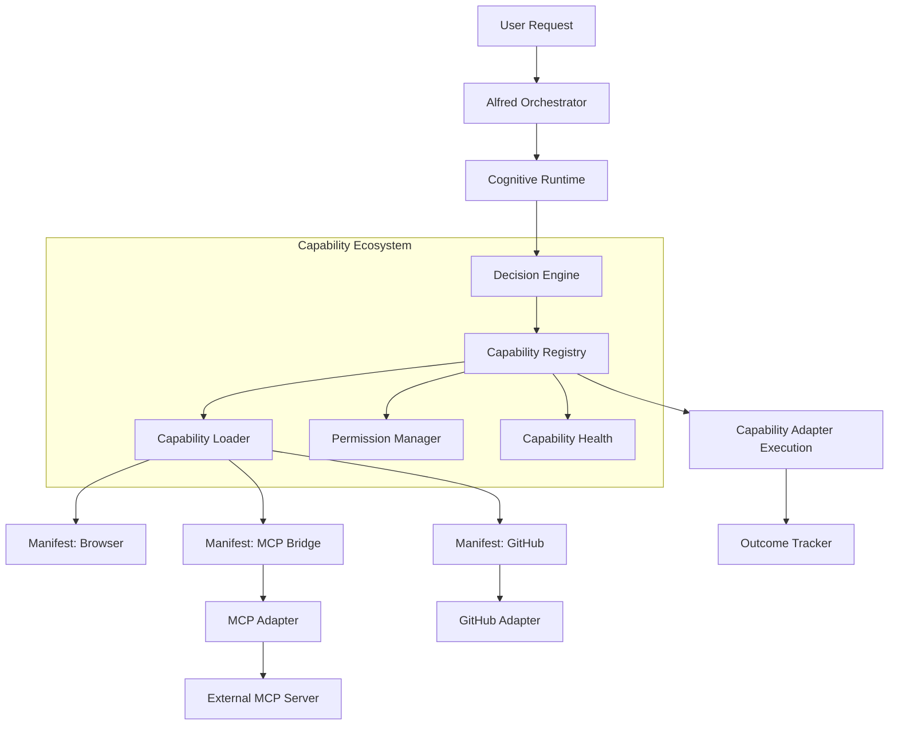

# Capability Adapter Framework Architecture

Jarvis X's Capability Adapter Framework transforms the system from a monolithic collection of hardcoded tools into an intelligent, modular ecosystem. Instead of directly installing or merging external repositories, capabilities are wrapped in standardized adapters and registered dynamically.

## Architecture Diagram



## Capability Lifecycle
1. **Discovery & Loading**: On startup (or dynamically), the `CapabilityLoader` scans the `manifests/` directory and loads `CapabilityManifest` JSON files.
2. **Registration**: Valid manifests are registered with the `CapabilityRegistry`.
3. **Routing Selection**: The `DecisionEngine` evaluates the request and scores agents and capabilities based on `capability_match`, `capability_reliability`, and `health_score`.
4. **Permission Check**: Before execution, the `PermissionManager` validates if the action (e.g., READ, WRITE, SENSITIVE) is authorized.
5. **Execution**: The `CapabilityAdapter.execute()` async method is invoked.
6. **Health Monitoring**: `CapabilityHealth` tracks success, failure, latency, and updates the reliability score.

## Adapter Design
Every capability must implement the `CapabilityAdapter` abstract base class:
- `async initialize()`: Prepare connections or resources.
- `async execute()`: Perform the core logic.
- `async health_check()`: Return status and latency.
- `async shutdown()`: Clean up resources.

## Manifest Format
Capabilities are defined by declarative JSON manifests. Example:
```json
{
  "name": "browser",
  "version": "1.0.0",
  "api_version": "1",
  "description": "Browser automation",
  "category": "automation",
  "inputs": ["url", "text"],
  "outputs": ["result"],
  "permissions": ["READ", "WRITE"],
  "confidence": 0.9
}
```

## MCP Integration
The Model Context Protocol (MCP) is integrated as a *capability source* rather than a core dependency.
The `src/jarvisx/capabilities/mcp/` package contains:
- `mcp_client.py`: Handles JSON-RPC communication.
- `mcp_adapter.py`: Implements the `CapabilityAdapter` interface to bridge MCP tools to Jarvis X.
- `mcp_registry.py`: Discovers and registers MCP servers.

## Permission Model
Capabilities request permissions in their manifest. The `PermissionManager` controls access:
- `READ`: Safe read-only operations.
- `WRITE`: Modifications to state or filesystem.
- `EXECUTE`: Running local binaries.
- `NETWORK`: Outbound network access.
- `SENSITIVE`: High-risk actions (e.g., publishing code, financial transactions) requiring explicit approval.

## Health Scoring & Fallback
The `CapabilityHealth` module tracks the success rate (`successful_calls / total_calls`).
If a capability's health drops below a threshold, or if it is unavailable, the `DecisionEngine` will gracefully fallback to an alternative capability or an existing internal tool, ensuring Alfred remains operational.
