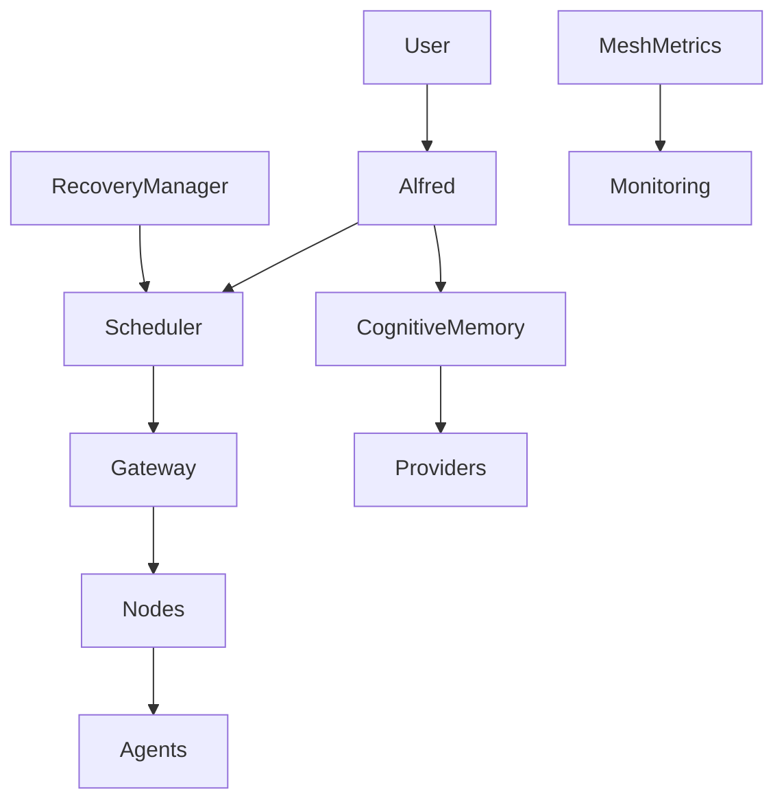

# Cognitive Agent Mesh Architecture

## 1. Overview

The Jarvis X architecture has undergone a profound evolution. We have transitioned from a localized, single-machine multi-agent system into a **production-grade cognitive distributed network**. 

Previously, agents operated within a constrained local runtime, sharing local memory boundaries and executing within a monolithic loop. The new Cognitive Mesh introduces a robust, distributed paradigm:
- **WebSocket Transport & Network Security**: Nodes now communicate securely over a distributed network layer.
- **Cognitive Memory**: Memory has evolved from simple key-value stores into structured Episodic, Semantic, and Procedural knowledge.
- **Health-Based Scheduling**: Task dispatching is dynamically balanced based on node health, latency, hardware availability, and agent success rates.
- **Autonomous Recovery (Self-Healing)**: The `RecoveryManager` monitors the mesh in real-time, autonomously detecting node failures and migrating mission-critical tasks to healthy backups without user intervention.

This transition enables Jarvis X to orchestrate unbounded clusters of specialized agents across diverse hardware boundaries while maintaining a singular, cohesive cognitive stream.

## 2. Complete Architecture Diagram

