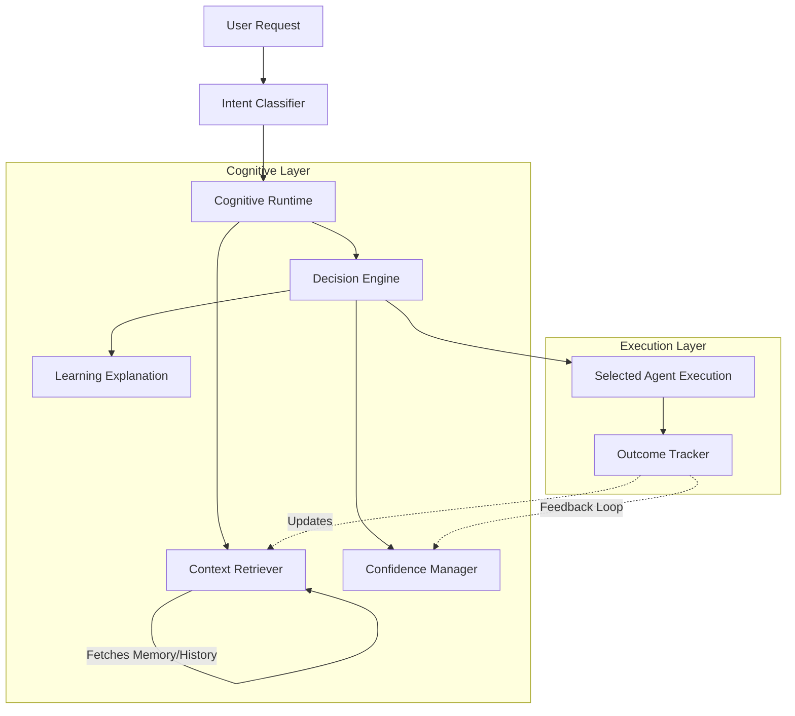

# Cognitive Runtime Architecture

Jarvis X's Cognitive Runtime serves as the intelligent middleware connecting intent extraction to agent execution. Instead of treating past executions as passive memory, the cognitive runtime actively leverages historical performance, user preferences, and failure patterns to route tasks to the most capable agent.

## Architecture Diagram



## Data Flow
1. **User Request**: The user asks a question (e.g., "Teach me Python decorators").
2. **Intent Extraction**: The request is routed to `AlfredOrchestrator`, which checks manual overrides (e.g., "Use Alfred").
3. **Cognitive Routing**: The request flows into the `CognitiveRuntime`.
4. **Context Retrieval**: The `ContextRetriever` queries memory for relevant history and preferences.
5. **Decision Engine**: The `DecisionEngine` evaluates a composite score for capable agents based on predefined weights.
6. **Execution**: The best-scoring agent receives the task.
7. **Tracking**: The `OutcomeTracker` logs success/failure to feed the next decision loop.

## Decision Lifecycle

The `DecisionEngine` ranks agents based on this heuristic formula (configured via `cognitive_weights.yaml`):

```
Agent Score = (Capability Match * W1) + (Historical Success * W2) + (Preference Match * W3) + (Confidence Score * W4)
```

## Confidence System

The `ConfidenceManager` ensures the system only relies on reliable predictions. 
- **Reinforcement**: A successful execution by the chosen agent boosts the confidence score.
- **Decay**: If a preference contradicts recent feedback, the confidence rapidly decays.

## Fallback Strategy and Safety Boundaries

1. **Test Mode Bypass**: In `JARVIS_TEST_MODE`, cognitive routing gracefully bypasses itself to ensure deterministic unit testing.
2. **Standard Fallback**: If the `DecisionEngine` cannot determine a winner or throws an exception, `AlfredOrchestrator` falls back to the deterministic `CapabilityRegistry` or `OmniRouter`.
3. **No Code Modification**: The runtime is completely restricted to **contextual behavior changes**. It cannot modify agent Python files or prompt logic directly.

## Mission Integration

The Cognitive Runtime actively tracks failure patterns. If the user encounters three consecutive failures for a specific task class, the runtime securely injects a prompt suggesting a new learning mission (e.g., "You've failed Python tasks 3 times. Would you like to create a learning mission?").
