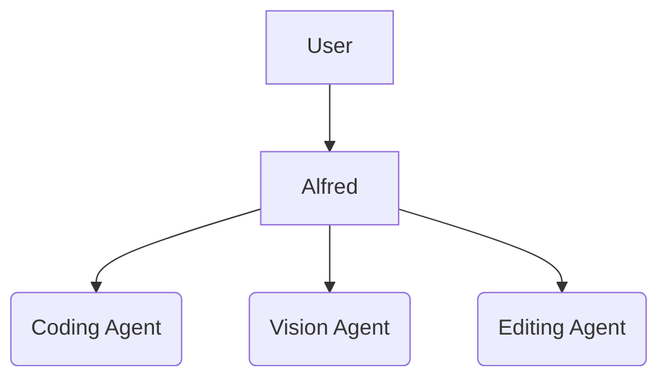
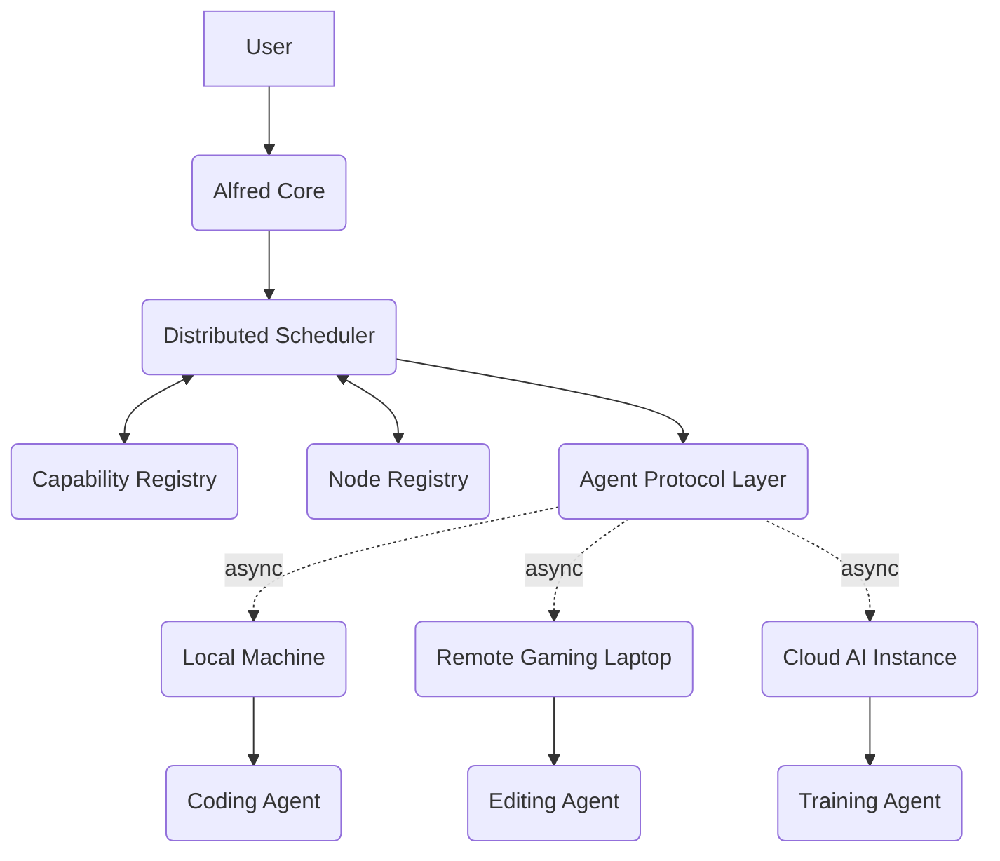
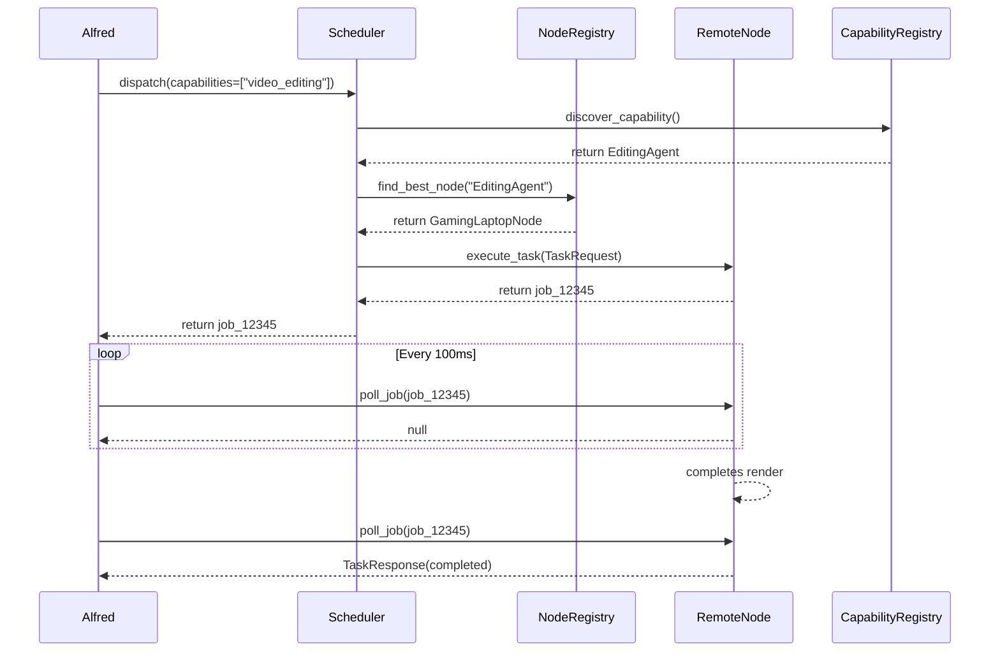

# Distributed Agent Mesh Architecture

## Overview

Jarvis X has transitioned from a monolithic, single-machine multi-agent system into a distributed agent mesh. This allows agents to be assigned to the most appropriate hardware across a network of trusted nodes, ensuring tasks are executed optimally while Alfred continues running asynchronously without blocking.

## Current Single-Machine Architecture vs New Distributed Architecture

### Old Architecture
Previously, all agents ran inside the same Python process loop as Alfred. 

### New Distributed Architecture
The new architecture abstracts execution into `WorkerNodes`. The `DistributedScheduler` sits in the middle, evaluating capability requirements and node latency before dispatching the task over the `AgentProtocol`.

## Node Lifecycle

1. **Authentication**: A node attempts to connect. The `NodeAuthenticator` verifies its `node_id` against a salted hash of the `secret_key`.
2. **Registration**: Once authenticated, the node calls `NodeRegistry.register_node()`, presenting its hardware properties and list of supported agents.
3. **Heartbeat**: The node emits periodic telemetry (latency, status) to `NodeRegistry.update_heartbeat()`.
4. **Execution**: The node accepts an incoming `TaskRequest` and returns a `job_id`.
5. **Death/Revocation**: If a heartbeat is missed for >300 seconds, the node is marked offline. Admins can permanently revoke node access.

## Communication Flow

All execution is **strictly asynchronous** to prevent blocking Alfred. 

