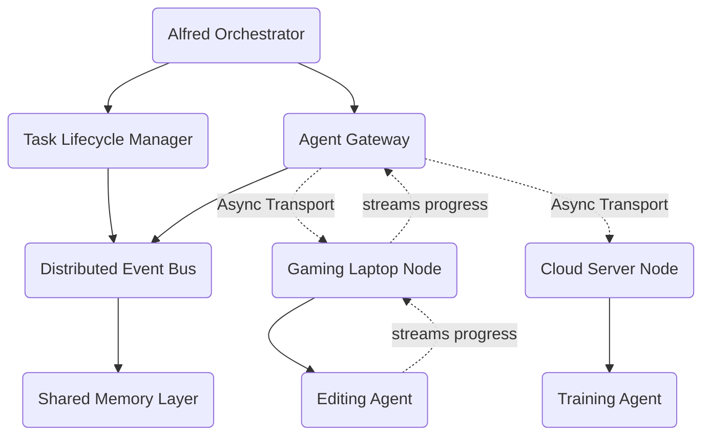
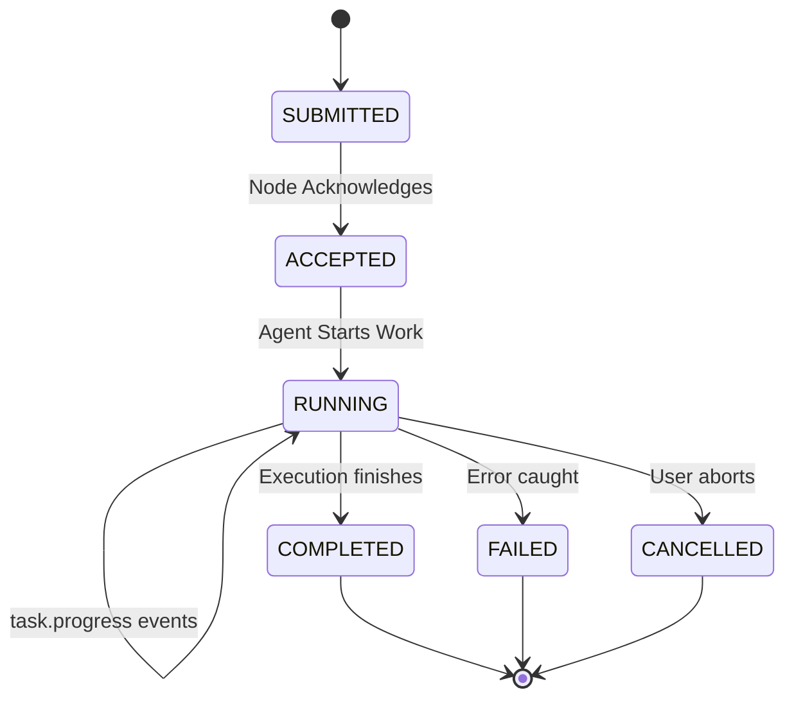

# Real-Time Connected Agent Network

## Overview
Jarvis X has evolved from a stateless distributed scheduler into a **Real-Time Connected Agent Network**. This upgrade introduces bi-directional communication, event streaming, task state tracking, and shared distributed memory between the core Alfred orchestrator and all remote execution nodes.

## Core Architecture

### 1. The Agent Gateway
The `AgentGateway` is responsible for holding persistent connections to remote worker nodes. It tracks connection state, handles missing heartbeats, and pushes/pulls messages over the transport interface.

### 2. Transport Abstraction
Currently, the network relies on `MockTransport` built around `asyncio.Queue`. This is purposefully designed so that a `WebSocketTransport` or `gRPCTransport` can be hot-swapped into the `AgentGateway` later without requiring any changes to business logic or message envelopes.

### 3. Message Envelope Protocol
All communication passes through standard JSON Envelopes:
- `task.request`: Dispatches work.
- `task.accepted`: Node acknowledges task.
- `task.progress`: Streams execution updates.
- `task.completed`: Returns the final results.
- `task.failed`: Returns stack traces and recovery context.

### 4. Distributed Event Bus
The `DistributedEventBus` broadcasts events locally so that modules (like the `AgentMonitor`) can react to state changes asynchronously. When a task completes, the event bus ensures all subscribing systems know immediately.

### 5. Shared Memory Layer
Agents operating on remote hardware need access to global state. `SharedMemory` uses the `MemoryProvider` interface (currently backed by a local Mock SQLite dictionary) to store and sync intelligence. Future integrations will include Cognee (Knowledge Graph) and Supabase (Distributed DB Sync).

## Task Lifecycle

The `TaskManager` acts as the single source of truth for all distributed tasks. Agents never mutate this state directly—they emit events that the Gateway forwards to the `TaskManager`.
